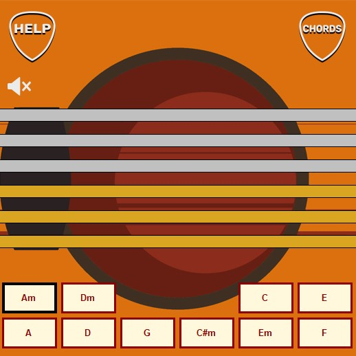
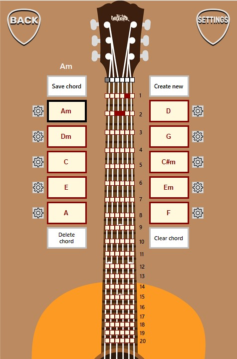
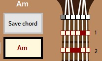
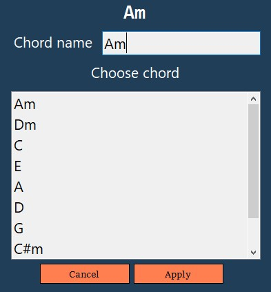
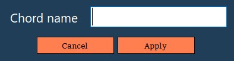
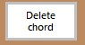
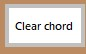
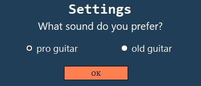
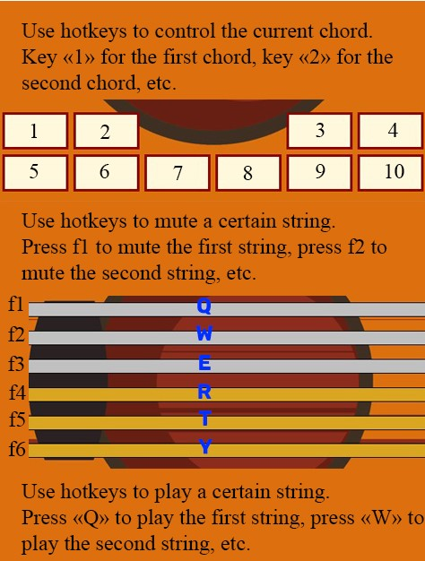

<h1>GordGuitar :guitar:</h1>

<h2>Play guitar on your windows PC</h2>

<h3>Game window:</h3>

To get the sound you need to move the cursor over the string, or you can use hotkeys [Q, W, E, R, T, Y].

<h3>Chord tuning window:</h3>

You can:

+ Tune your chord

   Just click on the mini buttons to choose the place on the string which you want to pluck. Use white (silver) mini buttons to mute the string.

   

+ Save your chord

   You can save your currently used chord. 
 
+ Rename or change chord

  

  

  Enter a new name or select a chord from the list of chords (saved chords) then just click apply.

+ Create new chord

  

  

+ Delete chord

  

  This button allows delete currently used chord from your disk

+ Clear chord

  

  This button clears all the strings on currently used chord.

+ Select guitar sound

  

All available hotkeys: 

_____

<h2>Links:link:</h2>

[Download program (Windows)](https://disk.yandex.ru/d/T-S0UOgCLEqu8A)

[My VK](https://vk.com/poseidon1337ac)

_____

<h2>Tools</h2>

+ Visual Studio 2019
+ C#
+ Winforms
+ .NET framework 4.7.2

_____

<h2>My email</h2>
kasual2014@icloud.com
