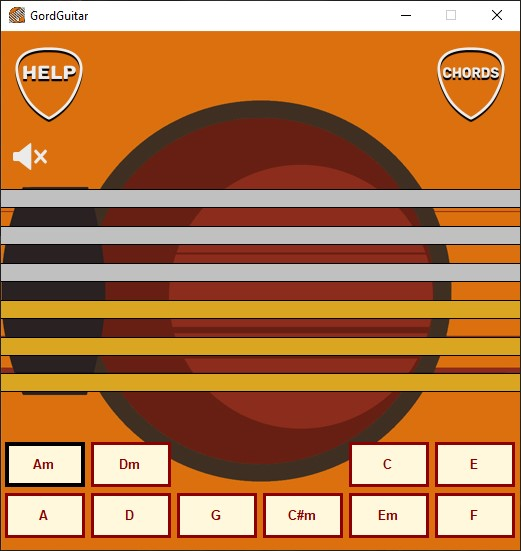
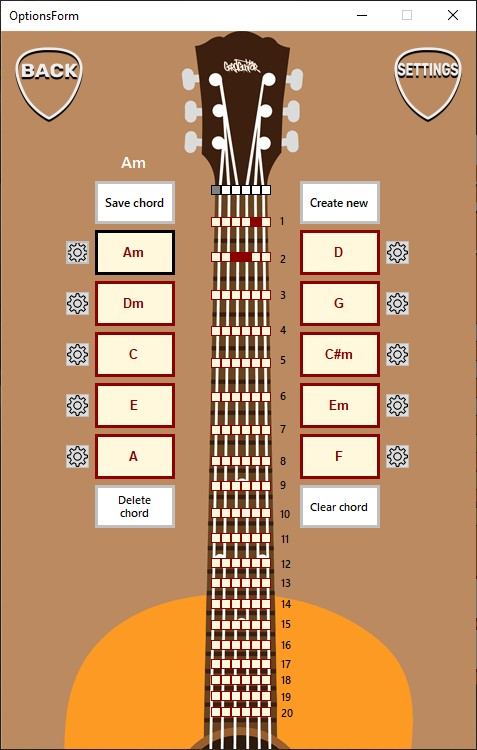
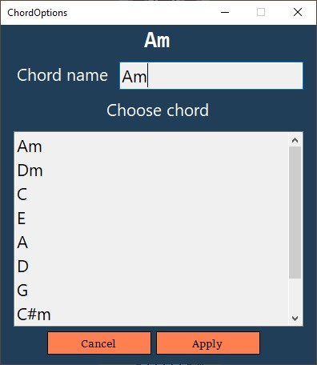

**<h1>GordGuitar :guitar:</h1>**

<h2>Play guitar on your windows PC</h2>

<h3>Game window:</h3>

To get the sound you need to move the cursor over the string, or you can use hotkeys [Q, W, E, R, T, Y].

<h3>Chord tuning window:</h3>

<h3>
You can:
</h3>

+ <h3>Tune your chord</h3>

   Just click on the mini buttons to choose the place on the string which you want to pluck. Use white (silver) mini buttons to mute the string.

   

+ <h3>Save your chord</h3>

   You can save your currently used chord. 
 
+ <h3>Rename or change chord</h3>

  

  

  Enter a new name or select a chord from the list of chords (saved chords) then just click apply.

+ <h3>Create new chord</h3>

  

  

+ <h3>Delete chord</h3>

  

  This button allows delete currently used chord from your disk

+ <h3>Clear chord</h3>

  

  This button clears all the strings on currently used chord.

+ <h3>Select guitar sound and set the volume</h3>

  

<h3>All available hotkeys: </h3>

_____

<h2>Last update 1.1 :star2:</h2>

- [X] Applicaton optimization.

  Changed how sound is played, using [ManagedBass](https://github.com/ManagedBass) wrapper for Bass.Net.dll instead of WindowsMediaPlayer;   Significantly increased startup speed; 

- [X] Fix bugs when there is no any saved chords.
_____

<h2>Some notes :pencil:</h2>

Files to storage data and sound files are in *bin/debug*
_____

<h2>Downloads :link:</h2>

[Download program (Windows)](https://github.com/Gorddd/GordGuitar/releases)

_____

<h2>Tools :hammer:</h2>

+ Visual Studio 2019 / 2022
+ C#
+ Winforms
+ .NET framework 4.7.2
+ ManagedBass